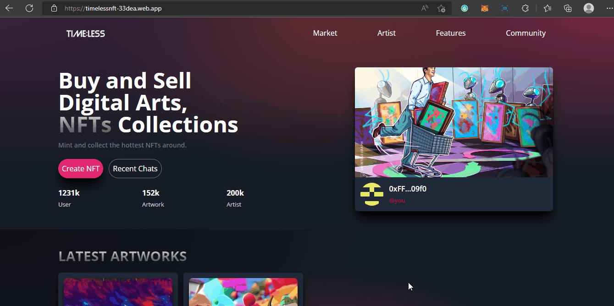

# Timeless is nft marketplace  Built on  React, Solidity, and CometChat
- ✨ [Live Demo](https://timelessnft-33dea.web.app/)


This app shows an NFT Marketplace built with React, Solidity, and CometChat:


<center><figcaption>TimelessNFT Project</figcaption></center>

## Technology

This app  uses the follong technologies:

- Metamask
- Truffle
- Infuria
- ReactJs
- Tailwind CSS
- Ganache-CLI
- Solidity
- Web3js
- Faucet

## Running the demo

To run the demo follow these steps :

1. Clone the project with the code below.
    ```sh

    # Make sure you have the above prerequisites installed already!
    git clone https://github.com/onchez/timelessNFT PROJECT_NAME
    cd PROJECT_NAME # Navigate to the new folder.
    yarn install # Installs all the dependencies.
    ```
2. Create an Infuria project, copy and paste your key in the spaces below.
3. Update the `.env` file with the following details.
    ```sh
    REACT_APP_INFURIA_PID=<INFURIA_API_KEY_HERE>
    REACT_APP_INFURIA_API=<INFURIA_API_KEY_SECRET_HERE>
    ```
4. Create a CometChat project, copy and paste your key in the spaces below.
5. Install truffle and ganache.
    ```sh
    npm install -g truffle
    npm install ganache --global
    ```
6. Run the app using the following commands.
    ```sh
    yarn install
    ganache -d
    truffle migrate --reset
    yarn start
    ```
7. Add some ganache accounts, connect your wallet and interact with the app.
<br/>


## Useful project links

-  [Metamask](https://metamask.io/)
-  [Remix Editor](https://remix.ethereum.org/)
-  [Truffle](https://trufflesuite.com/)
-  [Infuria](https://infura.io/)
- [ReactJs](https://reactjs.org/)
- [Solidity](https://soliditylang.org/)
- [Web3Js](https://docs.ethers.io/v5/)
- [Faucet](https://faucets.chain.link/rinkeby)
- [Ganache](https://trufflesuite.com/ganache/index.html)
